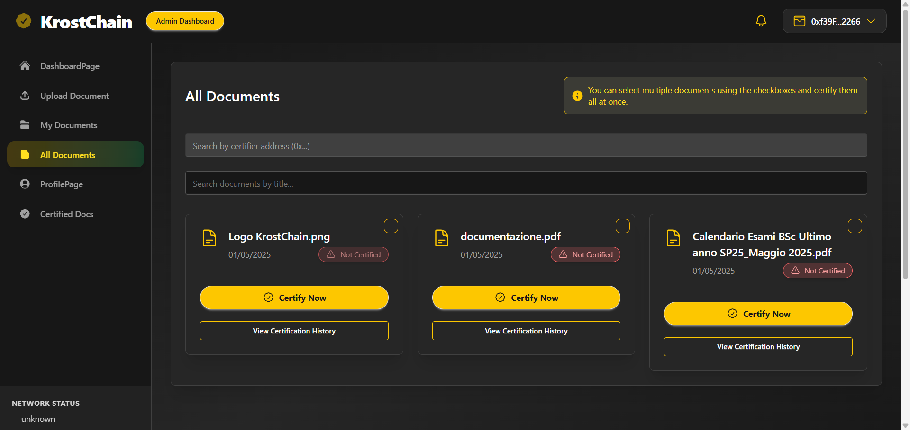
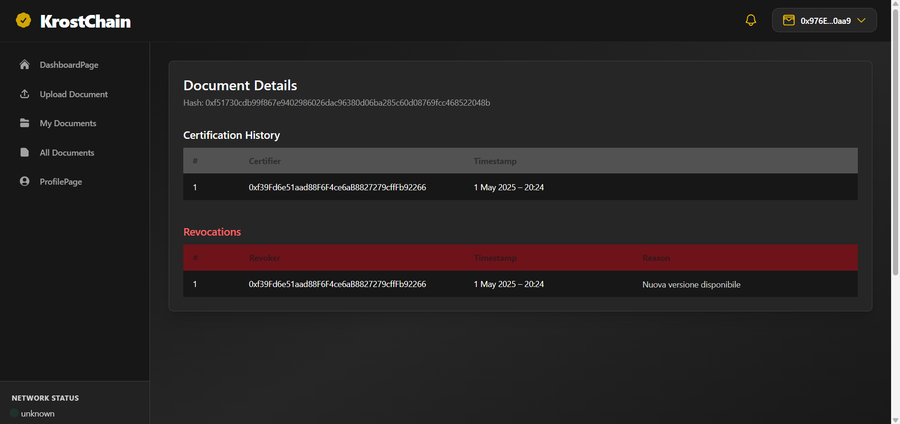
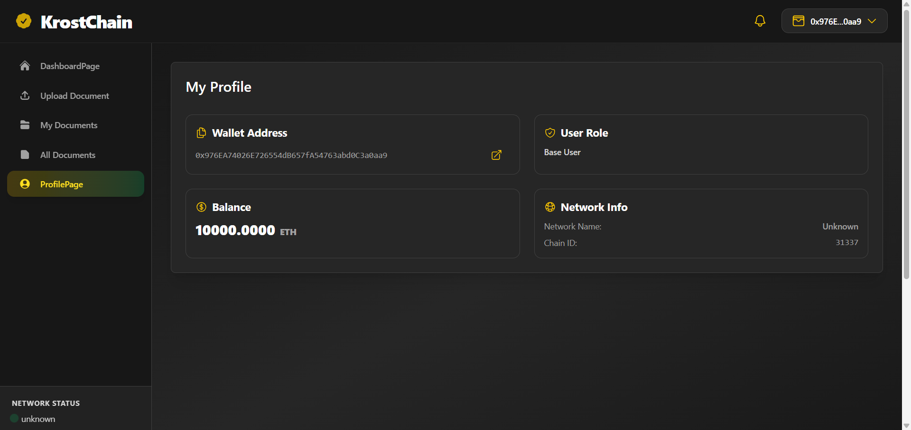
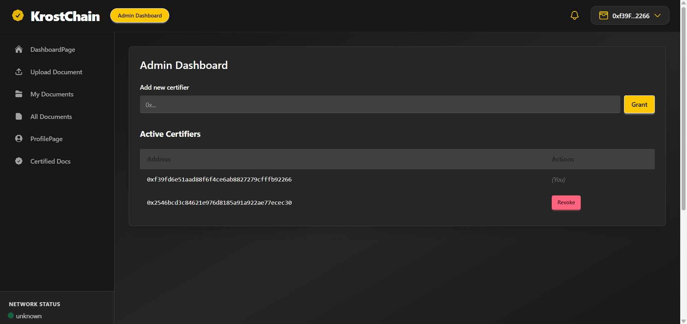
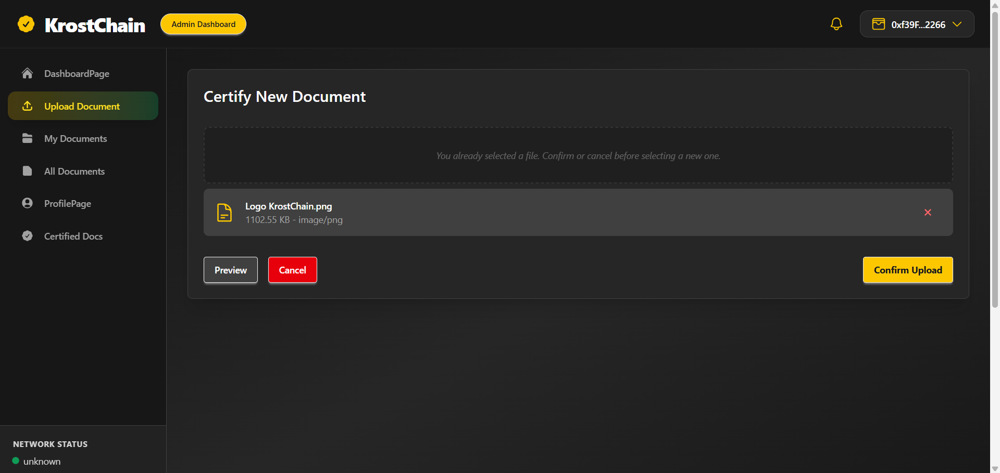

# 📜 KrostChain - Document Certification Platform on Blockchain

A web platform for certifying and revoking documents through smart contracts on Ethereum. It includes a dashboard, notification panel, wallet integration, role management, and audit trail.

---

## 📦 Tech Stack

- ⚙️ **Backend**: Java + Quarkus + REST
- 🧠 **Smart Contract**: Solidity + OpenZeppelin + Hardhat
- 🌐 **Frontend**: React + Tailwind + Ethers.js
- 🧪 **Test**: Vitest + React Testing Library + TanStack Query

---

## ⚙️ Setup Instructions

### 1. Clone the repository

```bash
git clone https://gitlab-edu.supsi.ch/dti-isin/giuliano.gremlich/opzione-blockchain-engineering/24-25/progetti-studenti/fanto-marrofino.git
cd fanto-marrofino
```

### 2. Install dependencies

#### Frontend

```bash
cd frontend
npm install
```

#### Backend

```bash
cd backend
./mvnw install
```

#### Smart Contract

```bash
cd contracts
npm install
```

---

## 🚀 Run the Application (Locally)

### 0. Start the MySQL Database (via Docker)

Make sure you have Docker installed, then run:

```bash
docker run --name krostchain-mysql \
  -e MYSQL_ROOT_PASSWORD=1234 \
  -e MYSQL_DATABASE=blockchainDocuments \
  -p 3306:3306 \
  -d mysql:latest
```

> 📝 These credentials must match your backend `application.properties`.

---

### 1. Start Hardhat Node

```bash
cd blockchain
npx hardhat node
```

---

### 2. Deploy the Smart Contract (on localhost)

```bash
npx hardhat run scripts/deploy.ts --network localhost
```

---

### 3. Start the Backend

```bash
cd backend
./mvnw quarkus:dev
```

---

### 4. Start the Frontend

```bash
cd frontend
npm run dev
```

Then open [http://localhost:3000](http://localhost:3000) in your browser.

---

## 🚢 Deployment Guide

### 📍 Deploy on Localhost (for development)

### 1. Start a local Hardhat node

```bash
cd blockchain
npx hardhat node
```

### 2. Deploy the contract to localhost

```bash
npx hardhat run scripts/deploy.ts --network localhost
```

### 3. Copy the deployed contract address

It will appear in the terminal output (e.g. `0x...`)

### 4. Update the frontend config

- Open: `frontend/src/config/config.ts`
- Replace the `contractAddress` with the one from step 3

---

### 🌐 Deploy on Sepolia Testnet

### 1. Edit `.env` inside `/contracts`

Make sure it contains:

```env
PRIVATE_KEY=<your Sepolia private key>
INFURA_API_KEY=a10fdf5acfcb4352828dc0b7a6a27b64
ETHERSCAN_API_KEY=13S52KAKXZC6YQW3Y8X9E5ESP3WSSFZ81T
```

### 2. Deploy the contract to Sepolia

```bash
npx hardhat run scripts/deploy.ts --network sepolia
```

### 3. Update the frontend config

- Open: `frontend/src/config/config.ts`
- Replace the `contractAddress` with the new Sepolia address

### 4. (Optional) Verify the contract on Etherscan

```bash
npx hardhat verify --network sepolia <contractAddress>
```

---

### ✨ Upgrade the Smart Contract (if needed)

If you made changes to the contract and need to **upgrade the deployed proxy**, run:

```bash
npx hardhat run scripts/upgrade.ts --network sepolia
```

> 🔐 Make sure the address in `.env` (under `PROXY_ADDRESS`) is correct before running.

---

### 🌐 Notes

- The **frontend** uses `VITE_INFURA_API_KEY` (set in `frontend/.env`)
- The `PROXY_ADDRESS` is saved in `.env` for reference but not used automatically
- You can switch between local and Sepolia by editing `PRIVATE_KEY` and the deployment network

---

## 🧪 Testing Instructions

### Frontend

```bash
cd frontend
npm run test
```

### Backend

```bash
cd backend
./mvnw test
```

### Smart Contracts

```bash
cd contracts
npx hardhat test
```

---

## 📸 Screenshots

### 📄 All documents page



### 🧾 Document details (certifications/revocations)



### 👤 Profile page



### 🛡️ Admin Dashboard



### 📩 Upload document



---

## 📚 Authors

- Antonio Marroffino
- Luca Fantò
